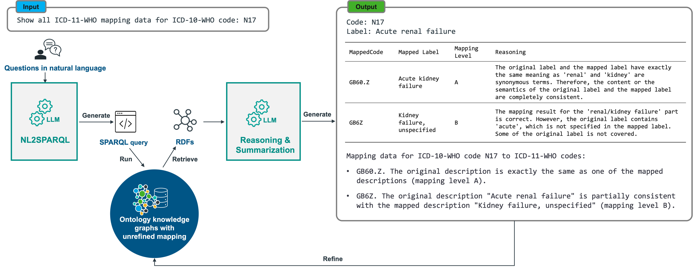

# OntologyRAG Prototype

This repository contains the materials for our OntologyRAG prototype - a customised ontology-enhanced retrieval-augmented genera-tion pipeline that leverages the in-context reasoning capabilities of off-the-shelf LLMs by infusing ontology knowledge graphs to enable coding experts executing better and faster code mapping.

## Pre-requisites

### Set-up oxigraph
  - Installation:
    - Installing with cargo following the instructions on the [oxigraph homepage]((https://crates.io/crates/oxigraph));

### Set-up Python environment
- Python 3.11 or 3.12
- Create and activate a Python virtual environment
```shell
$ python -m venv /path/to/venv
$ source /path/to/venv/bin/activate
```
- Installing dependencies:
```shell
$ pip install -r requirements.txt
```

### Set-up LLMs
The scripts provided in this repository assumes GPT-3.5-turbo and GPT-4 models accessible with an Azure account; [Meta-Llama-3-8B-Instruct](https://huggingface.co/meta-llama/Meta-Llama-3-8B-Instruct) and [Flan-T5-XXL](https://huggingface.co/google/flan-t5-xxl) hosted on an AWS instance with [Hugging Face's Text Generation Inference (TGI)](https://huggingface.co/docs/text-generation-inference/en/index). 

The scripts under the [llm](scripts/llm) folder are dedicated LLM calling interfaces with *clients.py* being the main script supporting the connection to different LLMs. If the LLMs are set up differently, there might be a need to customise scripts under this folder to run the retrieval pipeline successfully.

To access the GPT models, an Azure account (or OpenAI account if using OpenAI directly) is needed as a pre-requisite.

To access the Llama model, it is needed to get approval on Hugging Face. 

The [llm/configs.py](scripts/llm/configs.py) file should be updated with Azure account information and Hugging Face model's API endpoints if there's an existing Azure or a Hugging Face endpoint set-up to be used.

## Data preparation
- To run indexing and check the indexed graph data, download the [graph data](graph_data) provided in the repository.
- To reproduce the evaluation scores, download the [gold datasets](gold_datasets) and all results stored in [output folder](output_folder) provided in the repository.

## Pipeline running

The `main.py` script is the interface to execute the pipeline. It allows users to specify where the input and output data should be, as well as to select the steps to be executed in the pipeline. The pipeline code shared in this repository takes converted ontology graphs (instead of ontology source files) as input.



### Run indexing
To make ontology graphs and unrefined ontology mapping graphs available for querying, it is needed to make these graphs available in a graph database. In this prototype, we provide an example graph containing ICD-10-CM to ICD11 mapping (obtained from the [ICD11 official website](https://icd.who.int/en)) and users could use oxigraph to interact with the graph data.

Make sure there's a parent folder containing a subfolder named "source_ttl" storing source TTL files (in our repository, there is [./graph_data/source_ttl](graph_data/source_ttl)). Use the following command to index ontology graphs. Once succeeded, a graph store containing source data will be accessible at **./graph_data/graph_store**:
```shell
$ python main.py run_indexing -gr <path_to_graph_data_directory_containing_subfolder_with_source_file>
```
Example:
```shell
$ python main.py run_indexing -gr ./graph_data
```

Run the following command to use a web interface to send SPARQL query requests to interact with the graphs stored at **./graph_data/graph_store**:
```shell
$ oxigraph serve --location <path_to_graph_store_directory> --bind localhost:<port>
```
Example command:
```shell
$ oxigraph serve --location ./graph_data/graph_store --bind localhost:8888
```
The graphs will be accessible at http://localhost:8888.

Use the following SPARQL query to test if the graphs are loaded at the oxigraph server:
```SPARQL
PREFIX rdfs: <http://www.w3.org/2000/01/rdf-schema#>
PREFIX meta: <http://iqvia.com/ontologies/metadata/>
PREFIX dc: <http://purl.org/dc/elements/1.1/>
PREFIX : <http://iqvia.com/ontologies/mappings/>

CONSTRUCT {
    ?mapping :mapsFrom ?mapsFrom; :mapsTo ?mapsTo.
    ?mapsFrom :mappedValue "K25.9"; rdfs:label ?mapsFromLabel.
    ?mapsTo :mappedValue ?mapsToCode; rdfs:label ?mapsToLabel.
}
FROM <http://iqvia.com/ontologies/icd10cm_to_icd11_2024_full>
WHERE {
    ?mapping :mapsFrom ?mapsFrom; :mapsTo ?mapsTo.
    ?mapsFrom :mappedValue "K25.9".
    ?mapsTo :mappedValue ?mapsToCode.
    OPTIONAL {?mapsFrom rdfs:label ?mapsFromLabel}
    OPTIONAL {?mapsTo rdfs:label ?mapsToLabel}
}
```
The query should be able to retrieve a list of results displayed as a table.


### Run retrieval
The retrieval step in the pipeline connects the NL2SPARQL and Reasoning & Summarisation modules. Users could specify model name and prompting methods when running the pipeline.

Use the following command to retrieve information and generate response for code mapping question:
```shell
$ python main.py run_retrieval -i <one input code mapping question or list of input code mapping questions> -gs <path_to_graph_store_directory> -m <one of gpt-35, gpt-4, flan-xxl, llama-3> -p <one of the following: zero-shot, few-shot, few-shot-enhanced, cot>
```
Example: run retrieval with GPT-4 (and default: few-shot-enhanced prompt):
```shell
$ python main.py run_retrieval -i "Show all ICD11 mapping data for this ICD10WHO code: K05.1." -gs ./graph_data/graph_store -m gpt-4
```

### Run evaluation on code mapping
We provide a [gold dataset](gold_datasets/code_mapping/icd9cm_icd10cm_2018__mapping_gold_standard__baseline.xlsx) for evaluating code mapping results. This dataset is used to evaluate different models' performance in the ablation study.
Results for the ablation study from each selected LLM can be obtained from the [output folder](output_folder/code_mapping).

Use the following command to reproduce the ablation study evaluation score for each LLM.
```shell
$ python main.py eval_code_mapping -gc <path_to_code_mapping_gold_dataset_file> -pc <path_to_LLM_code_mapping_prediction_result> -mc <model_name_that_generated_prediction_result>
```
Example: run evaluation on GPT-4 direct code mapping output (ablation study)
```shell
$ python main.py eval_code_mapping -gc ./gold_datasets/code_mapping/icd9cm_icd10cm_2018__mapping_gold_standard__baseline.xlsx -pc ./output_folder/code_mapping/gpt-4 -mc gpt-4
```

### Run evaluation on mapping level
We provide a [gold dataset](gold_datasets/mapping_level/code_pair_mapping_level__gold_standard__reasoning.xlsx) for evaluating mapping level prediction results. This dataset is used to evaluate different models' performance at assessing the mapping proximity between two codes (queried code and retrieved code).
Results for the experiments from each selected LLM and prompting strategy can be obtained from the [output folder](output_folder/mapping_level).

Use the following command to reproduce the mapping level evaluation score for each LLM and prompting strategy combination. 
```shell
$ python main.py eval_mapping_level -gm <path_to_mapping_level_gold_dataset> -rpm <path_to_raw_mapping_level_prediction_result> -ppm <path_to_processed_mapping_level_prediction_result>
```
Example: run evaluation on result from GPT-4 and chain-of-thought prompt
```shell
$ python main.py eval_mapping_level -gm ./gold_datasets/mapping_level/code_pair_mapping_level__gold_standard__reasoning.xlsx -rpm ./output_folder/mapping_level/raw/cot/gpt-4 -ppm output_folder/mapping_level/processed/cot/gpt-4
```

## Notes
- This scripts that converts various ontology source files to ontology graphs are not included in this repository, as we consider them as a data preprocessing step before the indexing step in OntologyRAG. The authors have plans to make the scripts publicly available, but the formality is still under discussion. If you are interested in knowing more about the conversion process, please read the description in our manuscript or contact the authors.
- Most ontologies are proprietary, therefore the authors cannot provide the source files to some tested ontologies and mappings (such as SNOMED CT). The authors have included a [demo video](demo_video) to showcase using OntologyRAG retrieval pipeline with a web interface on retrieving and assessing unrefined mappings from ICD-10-WHO to ICD11.

## Disclaimer
Shield: [![CC BY-NC 4.0][cc-by-nc-shield]][cc-by-nc]

This work is licensed under a
[Creative Commons Attribution-NonCommercial 4.0 International License][cc-by-nc].

[![CC BY-NC 4.0][cc-by-nc-image]][cc-by-nc]

[cc-by-nc]: https://creativecommons.org/licenses/by-nc/4.0/
[cc-by-nc-image]: https://licensebuttons.net/l/by-nc/4.0/88x31.png
[cc-by-nc-shield]: https://img.shields.io/badge/License-CC%20BY--NC%204.0-lightgrey.svg